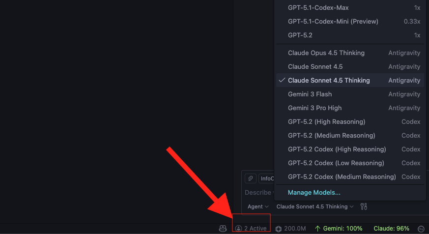
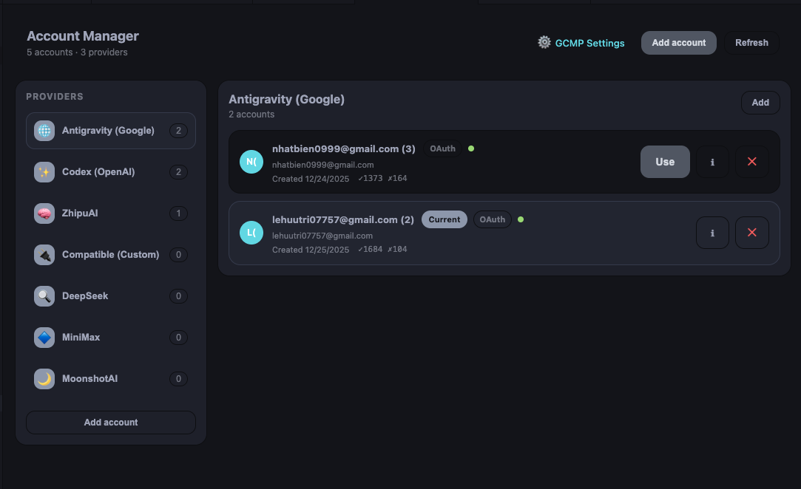
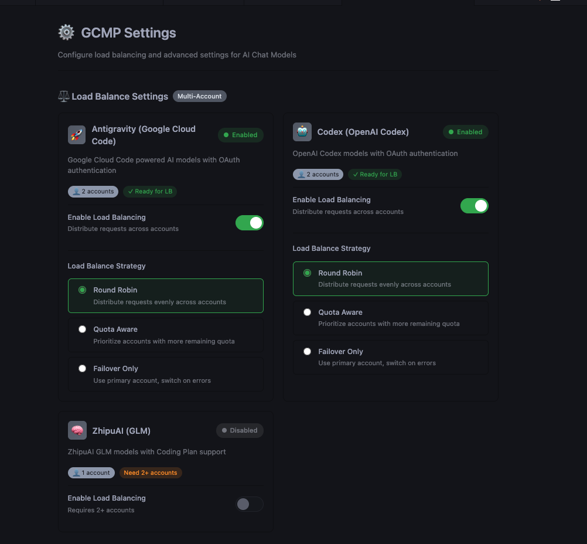

<div align="center">

# 🚀 Copilot Helper Pro


### **Supercharge your GitHub Copilot with multiple AI providers**

[](https://marketplace.visualstudio.com/items?itemName=vicanent.copilot-helper-pro)
[](https://marketplace.visualstudio.com/items?itemName=vicanent.copilot-helper-pro)
[](https://marketplace.visualstudio.com/items?itemName=vicanent.copilot-helper-pro)

[](LICENSE)
[](https://code.visualstudio.com/)
[](https://nodejs.org/)

<br/>

[📦 Install](#-installation) · [🚀 Quick Start](#-quick-start) · [✨ Features](#-key-features) · [⌨️ Keybindings](#%EF%B8%8F-keybindings)

</div>

---

## 📖 Overview

A powerful VS Code extension that provides model support for **GitHub Copilot Chat**, seamlessly integrating multiple AI providers including **ZhipuAI**, **MiniMax**, **MoonshotAI**, **DeepSeek**, **Antigravity (Google Cloud Code)**, **Codex (OpenAI)**, and custom **OpenAI/Anthropic** compatible models.

---

## 🤖 Supported Providers

<div align="center">

|      Provider      |     Description      | Highlights                         |
| :----------------: | :------------------: | :--------------------------------- |
|   🧠 **ZhipuAI**   |   GLM Coding Plan    | `Web Search` `MCP SDK`             |
|   ⚡ **MiniMax**   |     Coding Plan      | `Web Search` `Global Endpoints`    |
| 🌙 **MoonshotAI**  |   Kimi For Coding    | `High-quality Responses`           |
|  🔮 **DeepSeek**   |     DeepSeek AI      | `Fast Inference`                   |
| 🌐 **Antigravity** |  Google Cloud Code   | `Gemini Models` `Quota Tracking`   |
|    💻 **Codex**    |        OpenAI        | `GPT-5` `Apply Patch` `Shell Exec` |
| 🔧 **Compatible**  | OpenAI/Anthropic API | `Custom Models Support`            |

</div>

---

## ✨ Key Features

### 👥 Multi-Account Management

> **Manage multiple accounts per provider with ease**

- ➕ Add **unlimited accounts** for each AI provider
- ⚡ Quick switch between accounts with `Ctrl+Shift+Q` / `Cmd+Shift+Q`
- 📊 Visual account status in the status bar
- 🔐 Secure credential storage using VS Code Secret Storage

---

### ⚖️ Load Balancing & Auto-Switching

> **Automatic load distribution across accounts**

- 🔄 Auto-switch when hitting rate limits or quota exhaustion
- 📈 Intelligent retry with exponential backoff strategy
- 📉 Real-time quota monitoring and usage statistics
- 🔀 Seamless failover without interrupting your workflow

---

### ☁️ Antigravity (Google Cloud Code)

> **Access Gemini models via Google Cloud Code**

- 🌊 Streaming responses with real-time output
- 📊 Rate limit monitoring with automatic fallback
- 📈 Quota tracking with detailed usage statistics
- 👥 Multi-account support with intelligent auto-switching
- 🔏 Signature-based request validation for security

---

### 🤖 Codex (OpenAI)

> **Full access to OpenAI Codex capabilities**

- 🔓 **Full Access Sandbox Mode**: Unrestricted filesystem and network access
- 📝 **Apply Patch Tool**: Efficient batch file editing with unified diff format
- 💻 **Shell Command Execution**: Run terminal commands directly
- ✅ **Todo List Management**: Track tasks and plan your work session
- 🧠 **Thinking Blocks**: View model reasoning in real-time

---

### 🎯 Advanced Completion

> **Smart code completion features**

- 🔮 **FIM (Fill In the Middle)**: Intelligent code completion based on context
- ✨ **NES (Next Edit Suggestions)**: Predictive editing suggestions
- 🌐 **Web Search Integration**: Real-time information via ZhipuAI and MiniMax
- 📊 **Token Usage Tracking**: Monitor your API usage in real-time

---

## 📦 Installation

<details>
<summary><b>📥 From VS Code Marketplace (Recommended)</b></summary>

1. Open **VS Code**
2. Go to Extensions (`Ctrl+Shift+X` / `Cmd+Shift+X`)
3. Search for **"Copilot Helper Pro"**
4. Click **Install**

</details>

<details>
<summary><b>📁 From .vsix File</b></summary>

```bash
# Download from releases page, then in VS Code:
# Cmd+Shift+P > "Extensions: Install from VSIX..."
```

</details>

<details>
<summary><b>🔧 Build from Source</b></summary>

```bash
git clone https://github.com/nhatbien/copilot-helper.git
cd copilot-helper
npm install
npm run compile
npm run package
```

</details>

---

## 🚀 Quick Start

### Step 1: Configure Your Provider

| Provider       | Command                                                 |
| :------------- | :------------------------------------------------------ |
| 🧠 ZhipuAI     | `Cmd+Shift+P` → `ZhipuAI Configuration Wizard`          |
| ⚡ MiniMax     | `Cmd+Shift+P` → `Start MiniMax Configuration Wizard`    |
| 🌙 MoonshotAI  | `Cmd+Shift+P` → `Start MoonshotAI Configuration Wizard` |
| 🔮 DeepSeek    | `Cmd+Shift+P` → `Set DeepSeek API Key`                  |
| 🌐 Antigravity | `Cmd+Shift+P` → `Antigravity Login`                     |
| 💻 Codex       | `Cmd+Shift+P` → `Codex Login`                           |
| 🔧 Custom      | `Cmd+Shift+P` → `Compatible Provider Settings`          |

### Step 2: Add Multiple Accounts _(Optional)_

```
Cmd+Shift+P → "Copilot Helper Pro: Manage Accounts"
```

### Step 3: Enable Load Balancing

```
Cmd+Shift+P → "Copilot Helper Pro: Open Account Manager"
→ Toggle "Load Balance" for your provider
```

---

## 📚 Detailed Guide: Adding Accounts

### 🎯 How to Add Multiple Accounts

Follow these simple steps to add and manage multiple accounts for any provider:

#### **Step 1: Open Account Manager**

Press `Cmd+Shift+P` (macOS) or `Ctrl+Shift+P` (Windows/Linux) and type:

```
Copilot Helper Pro: Open Account Manager
```

<div align="center">

</div>

#### **Step 2: Select Your Provider**

Click on the provider you want to add an account for (e.g., ZhipuAI, MiniMax, MoonshotAI, etc.)

<div align="center">

</div>

#### **Step 3: Add New Account**

Click the **"Add Account"** button and enter your account credentials:

- **Account Name**: A friendly name to identify this account
- **API Key**: Your provider's API key
- **Additional Settings**: Provider-specific configurations (if any)

<div align="center">

</div>

#### **Step 4: Enable Load Balancing (Optional)**

Toggle the **"Load Balance"** switch to enable automatic account switching when rate limits are hit.

<div align="center">

</div>

### ✅ Account Management Features

- ✏️ **Edit Account**: Click the edit icon to modify account details
- 🗑️ **Delete Account**: Remove accounts you no longer need
- 🔄 **Switch Account**: Use `Ctrl+Shift+Q` / `Cmd+Shift+Q` for quick switching
- ⚖️ **Load Balance**: Automatically distribute requests across accounts
- 📊 **Quota Tracking**: Monitor usage and remaining quota in real-time

---

## ⌨️ Keybindings

| Shortcut                       | Action                              |
| :----------------------------- | :---------------------------------- |
| `Alt+/`                        | 🎯 Trigger inline completion        |
| `Shift+Alt+/`                  | 🔄 Toggle NES manual mode           |
| `Ctrl+Shift+A` / `Cmd+Shift+A` | 📎 Attach selection to Copilot Chat |
| `Ctrl+Shift+H` / `Cmd+Shift+H` | 🔗 Insert handle reference          |
| `Ctrl+Shift+Q` / `Cmd+Shift+Q` | 👤 Quick switch account             |

---

## 📋 Requirements

| Requirement            | Version      |
| :--------------------- | :----------- |
| 💻 VS Code             | `>= 1.104.0` |
| 📦 Node.js             | `>= 20.0.0`  |
| 📦 npm                 | `>= 9.0.0`   |
| 🤖 GitHub Copilot Chat | Required     |

---

## 🙏 Credits

<div align="center">

Special thanks to these amazing projects:

| [<br/>**LLMux**](https://github.com/Pimzino/LLMux) | [<br/>**GCMP**](https://github.com/VicBilibily/GCMP) | [<br/>**AntigravityQuotaWatcher**](https://github.com/wusimpl/AntigravityQuotaWatcher) |
| :---------------------------------------------------------------------------------------------------------------------------------: | :---------------------------------------------------------------------------------------------------------------------------------------: | :---------------------------------------------------------------------------------------------------------------------------------------------------------------------: |

</div>

---

## 📄 License

This project is licensed under the **MIT License** - see the [LICENSE](LICENSE) file for details.

---

<div align="center">

### 💖 Made with love for the developer community

**[⬆ Back to Top](#-copilot-helper-pro)**

</div>
